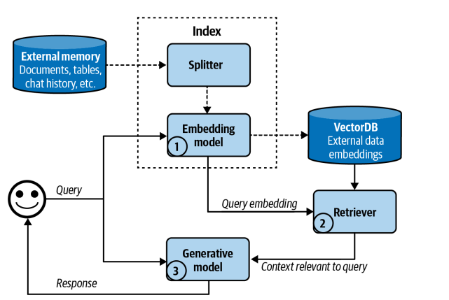

#  Sector Investment Chatbot

**_An AI-powered conversational sector investment chatbot specializing for Vietnam's economist, built using **Large language models (LLMs)**, **vector search**
---
## 🧠 Key Technologies

| Component              | Technology Used                   |
|------------------------|------------------------------------|
| 🧠 Large Language Model | DeepSeek-r1-0528-qwen3-8b via free OpenRouterAPI provider   |
| 📚 Vector Search Engine | all-MiniLM-L6-v2 model for embedding text and Faiss for vector search  |
| 💬 Chat Interface        | Streamlit                         |
| 🌐 API Backend          | FastAPI                          |

## 📘 Description

This chatbot system integrates several AI components to enable intelligent, and then answer questions about Vietnam’s economy in the voice of a sector expert. Below is an overview of how key functionalities are implemented:

### 🔍 1. Vector Search Engine

- ALl of the .docx files will be loaded and splitted into a smaller chunks using the RecursiveCharacterSplitting. It employs a recursive approach, meaning it repeatedly breaks down the text until it reaches the desired chunk size. And, in this we also use the overlap character to keep the continuous context and avoid the context missing. 
- The chunks are embedded using the **`all-MiniLM-L6-v2`** model from `sentence-transformers`, a compact yet powerful transformer that balances performance and speed. The embedding is stored and indexed in FAISS, enabling fast similarity search during chat interactions. **All the index and metadata file are stored in the `chatbot_api/src/Output`. We can update this by deleting this Output folder, Adding the folder of .docx files to the `chatbot_api/src/data`, and then, will automatically create the vector database in the first**. 
- When a user query is submitted:
  - It’s converted into a vector using `all-MiniLM-L6-v2`
  - FAISS is queried to return top relevant context passages
  - These passages are included in the prompt sent to the LLM for informed, grounded responses

### 🧠 2. Response Generation

- The chatbot uses a **Large Language Model (LLM)** (i.e., DeepSeek-r1-0528-qwen3-8) via free OpenRouterAPI provider (https://openrouter.ai/models) to generate fluent, human-like responses.
- Prompts are constructed based on:
  - System Prompt: Describe the task of this chatbot and define how model generate the response and use the external information. 
  - Retrieved knowledge from vector search
  - User Input
- The LLM is called via API in the backend (FastAPI) to return contextual and domain-relevant answers.


## 🗂 Project Structure

Below is an overview of the key components and folder structure used in this project:

### 📦 Backend Directory: `chatbot_api/src`

This folder contains the backend logic including the FastAPI server, vector search, user profile management, and LLM-based response generation.

- **Prompt Templates**  
  `chatbot_api/src/models`  
  Contains system prompts and templates used to guide the LLM for consistent behavior and structured responses.

- **Response Generation Logic**  
  `chatbot_api/src/response_generation_engine`
  Contains core logic to call the LLM model, assemble prompts, handle input-output formatting with retrieved context, and vector search engine.

## 🚀 Running the Project

### 📦 Requirements

- [Docker Desktop](https://www.docker.com/products/docker-desktop)
- Docker Compose (comes with Docker Desktop)
  
### 🔧 Run the Full Stack In Docker 

In the project root directory:

```bash
docker compose up --build
```

### 🧪 Run the App Locally (Without Docker)


If you prefer to run the backend and frontend manually:

#### 1. Install all required libraries for this project
```bash
pip install -r requirements.txt
```
 
#### 2. Update `.env` Configuration


Modify the `.env` file with the required API keys and settings.


#### 3. Run the Backend

```bash
cd chatbot_api/src
uvicorn main:app --reload
```
The backend will be available at: [http://localhost:8000](http://127.0.0.1:8000)

#### 4. Run the Frontend

In a new terminal:

```bash
cd chatbot_frontend/src
streamlit run main.py
```

The frontend UI will be available at: [http://localhost:8501](http://localhost:8501)
